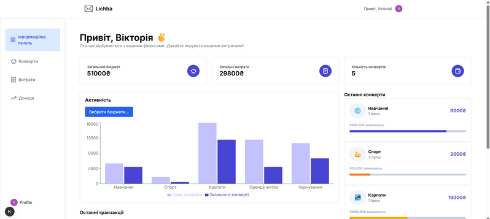
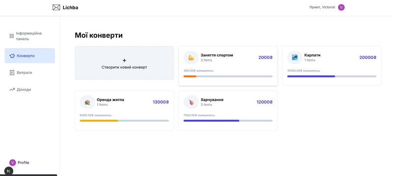
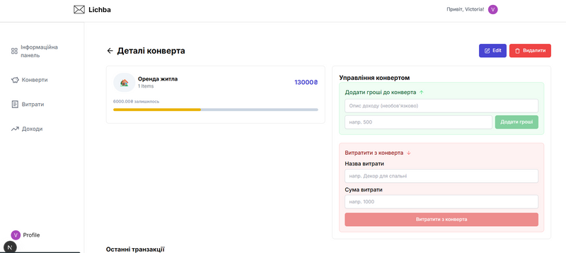

# 📘 Lichba - Особистий трекер витрат

> *Веб-застосунок для управління особистими фінансами з системою конвертів.*

---

## 👤 Автор

- **ПІБ**: Мирон Вікторія Романівна
- **Група**: ФЕП-41
- **Керівник**: доц. Франів В.А.
- **Дата виконання**: 31.05.2025

---

## 📌 Загальна інформація

- **Тип проєкту**: Веб-застосунок
- **Мова програмування**: JavaScript
- **Фреймворки / Бібліотеки**: Next.js 15, React 19, Tailwind CSS, Drizzle ORM
- **База даних**: PostgreSQL (Neon)
- **Авторизація**: Clerk

---

## 🧠 Опис функціоналу

- 🔐 Авторизація та реєстрація користувачів через Clerk
- 💰 Створення та управління бюджетними конвертами
- 📊 Відстеження доходів та витрат
- 📈 Візуалізація даних через діаграми
- 💸 Додавання грошей до конвертів
- 🛒 Витрачання коштів з конвертів

---

## 🧱 Опис основних файлів / компонентів

| Файл / Компонент | Призначення |
|------------------|-------------|
| `app/page.js` | Головна сторінка з Hero секцією |
| `app/(routes)/dashboard/page.jsx` | Головна панель користувача |
| `app/(routes)/dashboard/budgets/` | Управління конвертами |
| `app/(routes)/dashboard/expenses/` | Управління витратами |
| `app/(routes)/dashboard/income/` | Управління доходами |
| `utils/schema.jsx` | Схема бази даних (Drizzle ORM) |
| `utils/dbConfig.jsx` | Конфігурація підключення до БД |
| `middleware.ts` | Middleware для авторизації |
| `components/ui/` | UI компоненти (кнопки, діалоги, тости) |

---

## ▶️ Як запустити проєкт "з нуля"

### 1. Встановлення інструментів

- Node.js v18+ + npm
- Git

### 2. Клонування репозиторію

```bash
git clone https://github.com/myronvika/lichba.git
cd lichba
```

### 3. Встановлення залежностей

```bash
npm install
```

### 4. Створення `.env.local` файлу

```env
# Clerk (авторизація)
NEXT_PUBLIC_CLERK_PUBLISHABLE_KEY=your_clerk_publishable_key
CLERK_SECRET_KEY=your_clerk_secret_key
NEXT_PUBLIC_CLERK_SIGN_IN_URL=/sign-in
NEXT_PUBLIC_CLERK_SIGN_UP_URL=/sign-up

# База даних Neon
DATABASE_URL=your_neon_database_url
```

> **⚠️ Важливо**: У разі проблем із clerk .env.local надано в zip файлі

### 5. Налаштування бази даних

```bash
# Генерація та застосування міграцій
npm run db:push

# Запуск Drizzle Studio (опціонально)
npm run db:studio
```

### 6. Запуск проєкту

```bash
npm run dev
```

Відкрийте [http://localhost:3000](http://localhost:3000) у браузері.

---

## 🗂️ Структура бази даних

### Таблиця `budgets` (Конверти)
- `id` - унікальний ідентифікатор
- `name` - назва конверта
- `amount` - початкова сума
- `icon` - емодзі іконка
- `createdBy` - email користувача

### Таблиця `expenses` (Витрати)
- `id` - унікальний ідентифікатор
- `name` - назва витрати
- `amount` - сума витрати
- `budgetId` - посилання на конверт
- `createdAt` - дата створення

### Таблиця `income` (Доходи)
- `id` - унікальний ідентифікатор
- `name` - назва доходу
- `amount` - сума доходу
- `budgetId` - посилання на конверт
- `createdAt` - дата створення

---

## 🖱️ Інструкція для користувача

### 1. **Початок роботи**
- Перейдіть на головну сторінку
- Натисніть `Почати` для реєстрації/входу
- Заповніть форму реєстрації або увійдіть з існуючим акаунтом

### 2. **Створення конверта**
- У розділі "Конверти" натисніть `+` 
- Оберіть емодзі іконку
- Введіть назву конверта (наприклад, "Відпочинок")
- Вкажіть початкову суму
- Натисніть `Create Budget`

### 3. **Управління фінансами**
- **Додати гроші**: у детальному вигляді конверта заповніть форму "Додати гроші до конверта"
- **Витратити**: заповніть форму "Витратити з конверта" з назвою та сумою витрати
- **Переглянути історію**: всі транзакції відображаються в таблиці внизу

### 4. **Аналітика**
- Головна панель показує загальну статистику
- Діаграма активності відображає витрати по конвертах
- Список останніх транзакцій

### 5. **Інші розділи**
- **Витрати**: перегляд всіх витрат з можливістю видалення
- **Доходи**: перегляд всіх доходів з можливістю видалення

---

## 🧪 Проблеми і рішення

| Проблема | Рішення |
|----------|---------|
| Помилка підключення до БД | Перевірити DATABASE_URL в .env.local |
| Clerk авторизація не працює | Перевірити ключі CLERK в .env.local або використати файл з zip |
| Конверт не створюється | Переконатися що користувач авторизований |
| Toast повідомлення не з'являються | Перевірити підключення Sonner в layout.js |
| Стилі не застосовуються | Запустити `npm run build` та перевірити Tailwind конфігурацію |

---

## 🧾 Використані технології та джерела

### Основні технології:
- **Next.js 15** - React фреймворк
- **React 19** - UI бібліотека  
- **Tailwind CSS** - CSS фреймворк
- **Drizzle ORM** - TypeScript ORM
- **Clerk** - авторизація
- **Recharts** - діаграми
- **Lucide React** - іконки
- **Sonner** - toast повідомлення

### Документація:
- [Next.js Documentation](https://nextjs.org/docs)
- [Drizzle ORM](https://orm.drizzle.team/)
- [Clerk Documentation](https://clerk.com/docs)
- [Tailwind CSS](https://tailwindcss.com/docs)
- [Neon Database](https://neon.tech/docs)

---

## 📷 Приклади / скриншоти

| Панель управління | Сторінка конвертів | Деталі конверта |
|:---:|:---:|:---:|
|   |  | |

---

## 📝 Ліцензія

Цей проєкт створено в навчальних цілях.
